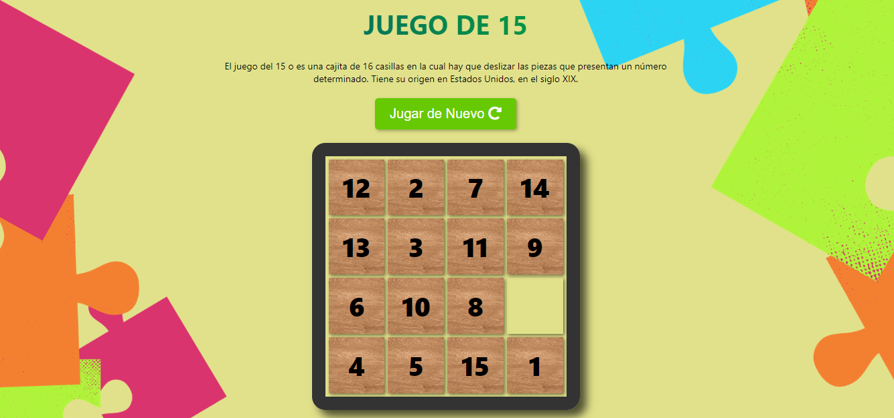

# Juego de 15 Casillas

Este juego es un rompecabezas clásico donde el objetivo es ordenar los números del 1 al 15 deslizando las celdas en un tablero. Al iniciar el juego, se desordena el tablero y el jugador debe deslizar las celdas para ordenar los números.

Link del juego online: https://puzzle-taken-game.netlify.app/

## Características

- Interfaz gráfica para el usuario (GUI) con celdas deslizables.
- Temporizador que muestra el tiempo transcurrido mientras juegas.
- Mensaje de felicitaciones y tiempo total al completar el juego.
- Botón para reiniciar el juego.
- Estilos con CSS para una apariencia atractiva.

## Herramientas utilizadas

El juego se ha desarrollado utilizando:

- HTML, CSS y JavaScript Vanilla para la lógica y presentación.
- Bibliotecas como Font Awesome para íconos.
- Git para control de versiones.

## Instrucciones de uso

1. Abre el juego en un navegador web.
2. Haz clic en "Empezar" para iniciar el juego.
3. Desliza las celdas para ordenar los números.
4. Al completar el juego, se mostrará un mensaje con el tiempo transcurrido.
5. Si deseas jugar de nuevo, haz clic en "Jugar de Nuevo".

¡Diviértete jugando!

## Captura de pantalla

